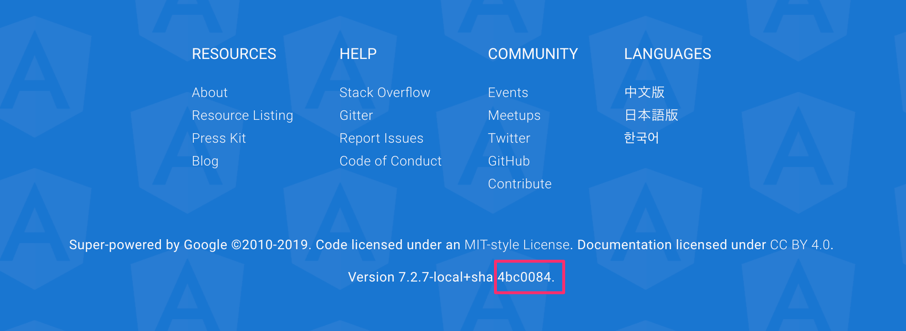

How to update the original content of # angular.io

## Advanced preparations

-prepare node_modules
-Preparation of Git submodules

## Workflow

1. Edit `update-origin.sh`

Get the `aioHash` from the last angular.io footer.

`` `sh
aioHash = "4bc0084"
`` ''

2. Run `update-origin.sh`

3. Migrate your changes

## Migration

### Pattern 1. Original to original

-`foobar.md` (not translated)
-`contributors.json`
-`resouces.json`
-`presskit.html`

If the translated file does not exist, it will be applied as is.

### Pattern 2. Original translated file

-`foobar.en.md`
-`index.en.html`

#### If the change is small

If the changes need to be translated again, they will be reflected in the translated file.

#### When the changes are big

1. Copy the original text into the corresponding part of the translated file in the untranslated state so that it is in a mixed state of Spanish and English.
2. Create an Issue to request the translation of untranslated parts.

### Pattern 3. aio application code

Some files have been modified to modify the angular.io application, but a git update removes those changes.

-`navigation.model.ts`
-`nav-item.component.html`
-`doc-viewer.component.ts`
-`githubLinks.html`

For these files, leave the changes you want and merge the other changes manually.